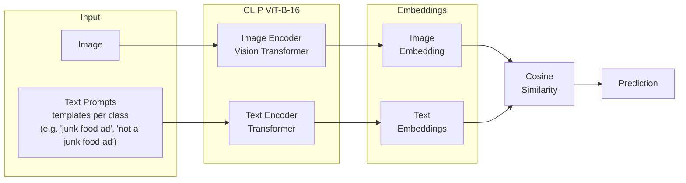
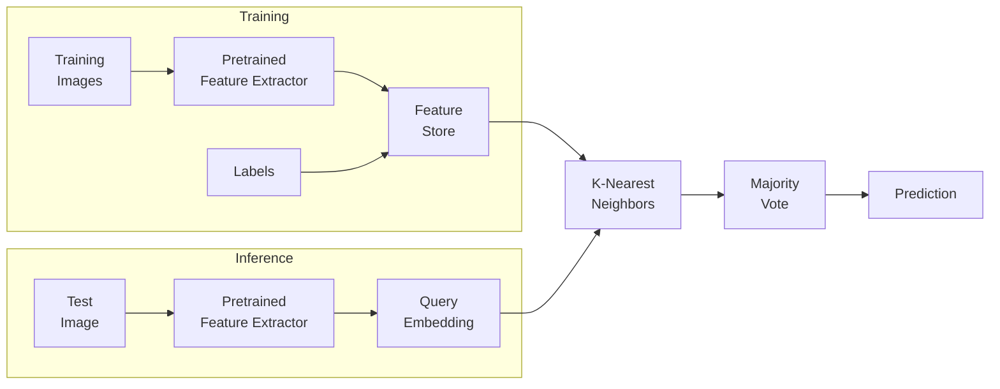
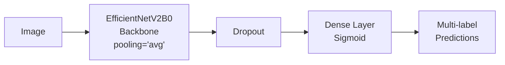
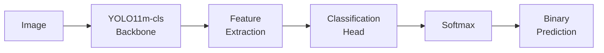

# Junk Food Ads Classifiers

A research project that evaluates multiple strategies for classifying junk food advertisements in images. This repository compares different vision models and classification approaches to classify unhealthy food marketing content.

## Classification Types

The project explores two classification paradigms:

- **Binary Classification**: Determines whether an image contains junk food advertising (junk food ad/non junk food ad)
- **Multi-label Classification**: Identifies specific categories of junk food present in advertisements (e.g., pizza, hamburger, soda...)

## Strategies

### Binary Classification

| Strategy      | Model                  | Framework   | Pretrained Weights  |
| ------------- | ---------------------- | ----------- | ------------------- |
| CLIP Binary   | ViT-B-16               | OpenCLIP    | `laion2b_s34b_b88k` |
| KNN Binary    | Multiple (see note ^1) | torchvision | ImageNet            |
| YOLO11 Binary | YOLO11m-cls            | Ultralytics | ImageNet            |

### Multi-label Classification

| Strategy         | Model                  | Framework   | Pretrained Weights  |
| ---------------- | ---------------------- | ----------- | ------------------- |
| CLIP Multi-label | ViT-B-16               | OpenCLIP    | `laion2b_s34b_b88k` |
| KNN Multi-label  | Multiple (see note ^1) | torchvision | ImageNet            |
| CNN Multi-label  | EfficientNetV2B0       | TensorFlow  | ImageNet            |

> **^1 KNN Feature Extractors**: The KNN notebooks evaluate multiple pretrained models as feature extractors: ResNeXt-101, EfficientNet V2, ConvNeXt, ViT, Swin Transformer, and DINOv2.

### Architecture Details

#### CLIP

Zero-shot classification by comparing image embeddings against text descriptions of junk food categories.

#### k-NN

Extracts feature embeddings using pretrained models (see note ^1) and classifies based on similarity to labeled training examples.

#### CNN

Fine-tunes EfficientNetV2 with transfer learning for multi-label prediction.

#### YOLO 11

Leverages the classification variant of YOLO11 for efficient binary classification.

## Getting Started

All notebooks are designed to run in Google Colab with GPU acceleration. Before running:

1. Enable GPU runtime in Colab (Runtime > Change runtime type > GPU)
2. Set up required secrets in Colab:
   - `ROBOFLOW_API_KEY`
   - `ROBOFLOW_WORKSPACE_ID`
   - `ROBOFLOW_PROJECT_ID`
   - `ROBOFLOW_DATASET_VERSION`

Due to copyright reasons, we cannot provide the dataset we used.
